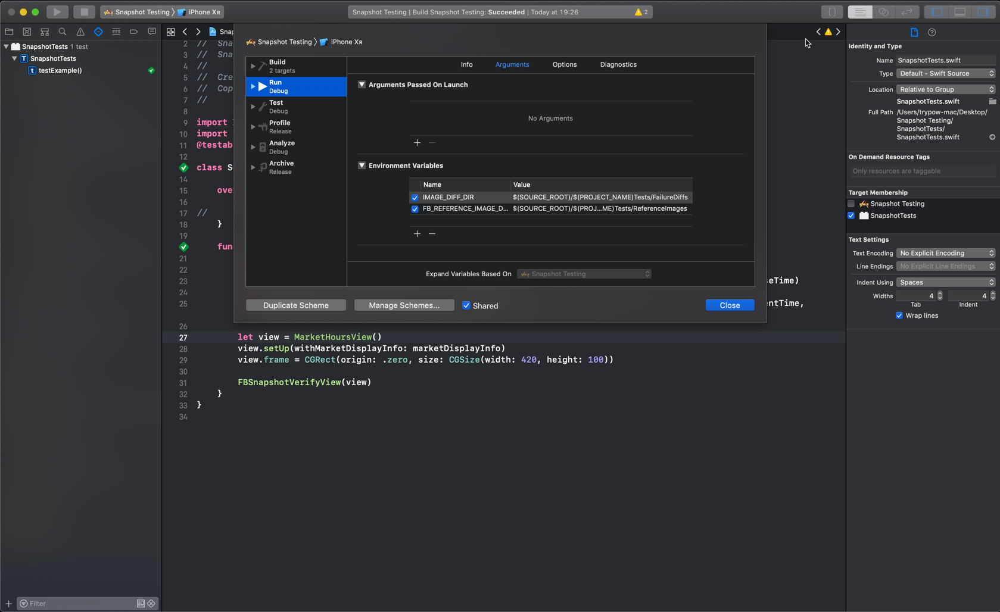

# Screenshot Tests

This is a project to demonstrate how screenshot testing works and how to setup and configure in your iOS project.

## Documentation
Take a look at the documentation at https://github.com/uber/ios-snapshot-test-case

## Getting started

#### Setup Guide:

1. Create a Project with Unit Test Target
2. Run `pod init` (make sure you have the latests cocoapods)
3. Open `Podfile` and paste the following

     ```ruby
     target 'YourProjectName' do
       use_frameworks!
       pod 'iOSSnapshotTestCase'
     end
     
    target 'YourProjectNameTests' do
      inherit! :search_paths
      pod 'iOSSnapshotTestCase'
    end
     ```
4. Run `pod install`
5. Add the following Environment Variables in your Project

    |Name|Value|
    |:---|:----|
    |`FB_REFERENCE_IMAGE_DIR`|`$(SOURCE_ROOT)/$(PROJECT_NAME)Tests/ReferenceImages`|
    |`IMAGE_DIFF_DIR`|`$(SOURCE_ROOT)/$(PROJECT_NAME)Tests/FailureDiffs`|
    
    

    Of course you can set any folder you want inside your project, depending on where you want to save your Reference Images       that will be created from Screenshot Testing.


#### Configuration:

We have created some combination functions that takes care to test multiple devices and even multiple themes.
With those configurations you will make sure that you cover Minor and Edge Cases that can strech your UI and also
creating images can make a lot easier the communication with the Designer of the App.

You can find the configuration files here
